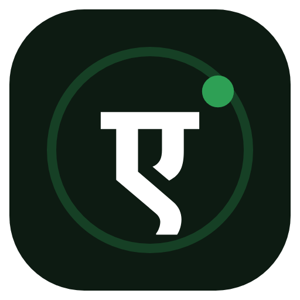

<p align="center">
  
</p>

<h1 align="center">Krutrim <span>Ekam</span></h1>
<p align="center"><b>One identity for every principal — human or agent.</b><br>
The agent-identity &amp; delegation control plane for the Ola / Krutrim group.</p>

<p align="center">
  <a href="https://ekam.olakrutrim.com">Live</a> ·
  <a href="https://ekam.olakrutrim.com/docs">Docs &amp; API</a> ·
  <a href="https://ekam.olakrutrim.com/cookbook">Cookbook</a> ·
  <a href="https://ekam.olakrutrim.com/privacy">Privacy</a> ·
  <a href="https://ekam.olakrutrim.com/terms">Terms</a>
</p>

---

## What is Ekam?

**Ekam** (एकम् — "one") is an OAuth 2.1 / OIDC authorization server purpose-built for the
agent era. It gives every principal — a **human** who signs in, or an **agent** that runs
unattended — a single, verifiable identity, and it brokers **short-lived, audience-bound,
delegated tokens** that downstream services (gateways, MCP servers, APIs) verify **offline**.

Ekam is **gateway-neutral**: it issues the token, and any AI gateway, MCP server, or API verifies it
**offline**. Ekam also **meters usage and bills the owner itself** — its own metering, billing, and
usage, so it isn't tied to any one gateway.

## Key features

- **Human + agent parity** — every capability ships as a human UI *and* a JSON/MCP API.
- **Independent metering & billing** — Ekam tracks token/agent usage and bills the owner directly,
  works with any gateway.
- **Offline verification** — ES256 JWTs + JWKS; gateways verify without calling home, with an
  optional live **kill-switch** via introspection (RFC 7662).
- **Delegation that travels** — RFC 8693 token-exchange + **ID-JAG / Cross-App Access**: carry a
  verified identity from app A to app B, tenant &amp; entity preserved.
- **MCP on-ramp** — RFC 9728 Protected Resource Metadata so agents *discover* how to get a token.
- **Standards-native** — RFC 8414 / 9728 discovery, 8707 audience binding, 7662 introspection.
- **Multi-tenant** — `tenant` (customer) → `entity` (legal entity) → `owner` (billable) →
  `blueprint` → `agent`, with scopes, classification ceilings, and cost centers on every token.
- **Built for India** — hosted on Krutrim Cloud, DPDP-aligned, DR enabled.

## Two ways in

| Principal | How it authenticates |
|-----------|----------------------|
| **Human** | Sign in with Google (Ola domains: `olacabs.com`, `olaelectric.com`, `olakrutrim.com`). Other domains → **Request access**. |
| **Agent** | Owner key → `POST /oauth/token` → a scoped, audience-bound token. Or discover the AS via MCP (RFC 9728). |

## Sample code

This repo holds runnable samples — see [`examples/`](examples/). The same recipes are browsable at
[ekam.olakrutrim.com/cookbook](https://ekam.olakrutrim.com/cookbook) (no login required):

| Recipe | File |
|--------|------|
| Verify an Ekam token in your gateway (SDK) | [`examples/verify-gateway.ts`](examples/verify-gateway.ts) |
| Provision an agent &amp; broker a token | [`examples/provision-and-broker.sh`](examples/provision-and-broker.sh) |
| Govern an MCP server with Ekam (RFC 9728) | [`examples/govern-mcp.md`](examples/govern-mcp.md) |
| Cross-app delegation with ID-JAG | [`examples/idjag.sh`](examples/idjag.sh) |
| Add Ola Google SSO to your app | [`examples/sso.html`](examples/sso.html) |
| Kill-switch: revoke a compromised agent | [`examples/revoke.sh`](examples/revoke.sh) |

## Verify a token in one import

```ts
import { createEkamVerifier } from "@krutrim/ekam-verify";

const verify = createEkamVerifier({
  issuer: "https://ekam.olakrutrim.com",
  jwksUri: "https://ekam.olakrutrim.com/.well-known/jwks.json",
  audience: "https://your-gateway.example",
});

const principal = await verify(token); // { agentId, ownerId, scopes, tenant, entity, ... }
```

## Status

Live at **https://ekam.olakrutrim.com** · invite-only (v1) · DR enabled. The control-plane source is
maintained privately by the Krutrim team; this repo is the public front door — samples, docs links,
and issue tracking.

## Contributing / feedback

- 🐞 [Report an issue](https://github.com/ekamkrutrim/ekam/issues/new?labels=bug&template=bug_report.md)
- 💡 [Request a feature](https://github.com/ekamkrutrim/ekam/issues/new?labels=enhancement&template=feature_request.md)

---

<p align="center"><sub>© Krutrim SI Designs Private Limited · a Krutrim group company · hosted on Krutrim Cloud (India)</sub></p>
